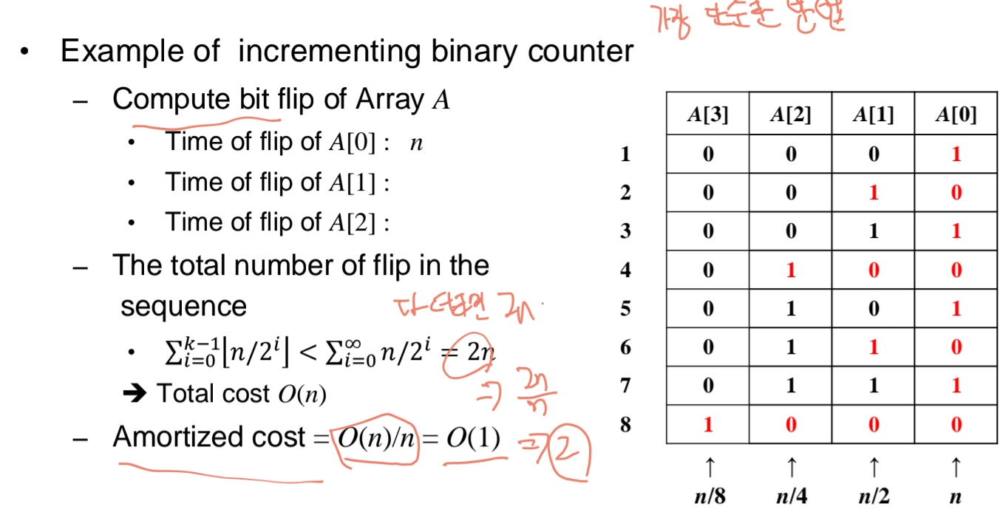

# Amortized Analysis
Amortized Analysis는 자료구조의 연산 시 일련의 연산 시퀀스 전체에 대해 평균 수행 시간을 계산하는 분석 기법입니다.
특정 연산 하나는 매우 비용이 클 수 있지만, 여러 연산을 묶어 평균 내면 연산 하나당 평균 비용이 작게 유지되는 것을 보장할 수 있습니다.
- 평균 분석(average-case analysis)와 달리, 확률을 사용하지 않고 최악의 경우에도 평균 성능을 보장합니다.
- 대표적인 3가지 기법이 있습니다:
  - ① 집합 분석 (Aggregate Analysis)
  - ② 회계 방법 (Accounting Method)
  - ③ 잠재적 함수 방법 (Potential Method)

## Aggregate Analysis (집합 분석)
모든 연산에 대해 동일한 암묵적 비용(amortized cost)을 부여합니다.
- 예시1: Stack에서 PUSH, POP, MULTIPOP 연산을 고려
  - 각각의 PUSH, POP는 실제 비용이 1
  - MULTIPOP은 최대 O(k) 비용
- 총 n개의 연산이라면 실제 총 비용은 O(n) -> total
  - 평균 암묵적 비용은 O(n)/n = O(1) -> average
- 모든 연산에 대해 O(1)의 암묵적 비용을 적용함
- 예시2: binary counter의 1씩 증가하는 경우 자리수마다 연산수가 다른데 평균을 낼 수 있다.
  - 

## Accounting Method (회계 방법)
각 연산마다 다른 암묵적 비용을 인위적으로 부여하여, 초과한 비용은 "크레딧(credit)"으로 저장해 둡니다.
- 크레딧은 이후 실제 비용이 더 많이 드는 연산을 미리 지불한 비용으로 충당
- 예시1: stack에서 PUSH, POP, MULTIPOP 연산을 고려(pop비용을 push에 미리 충당)
  - PUSH: 실제 비용 1, 암묵적 비용 2
  - POP: 실제 비용 1, 암묵적 비용 0
  - MULTIPOP: 실제 비용 min(k,s), 암묵적 비용 0
- 예시2: binary counter 증가
  - 0 -> 1: 비용 1, 암묵적 비용 2
  - 1 -> 0: 비용 1, 암묵적 비용 0
- 항상 총 크레딧 >= 0이 되도록 설정

## Potential Method (잠재적 함수 방법)
자료구조 전체의 상태에 따라 잠재함수(potential function)를 정의하고, 변화량(ΔΦ)을 기준으로 연산의 암묵적 비용을 계산합니다.
- 예시: stack
  - potential function: stack의 크기
  - 그래서 다음과 같은 조건 만족: Φ(Di) >= 0 = Φ(D0)
    - 연산의 어떤 상태에서도 잠재함수는 0보다 크거나 같음

## Dynamic Table 확장 축소 예시
- TABLE-INSERT 배열 확장 필요 시 모든 항목 이동 -> O(n) 가능
- 하지만 암묵적으로 3의 비용만 할당해도 충분(Accounting 방법)
  - 1: 현재 테이블에 삽입
  - 1: 자신 이동
  - 1: 다른 항목 이동
- 따라서 n개의 삽입 시 총 비용 O(n), 연산당 암묵적 비용 O(1) 보장