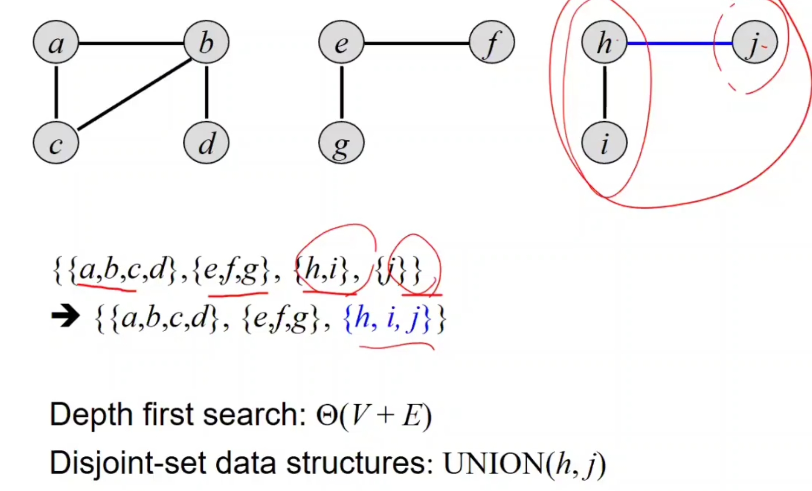
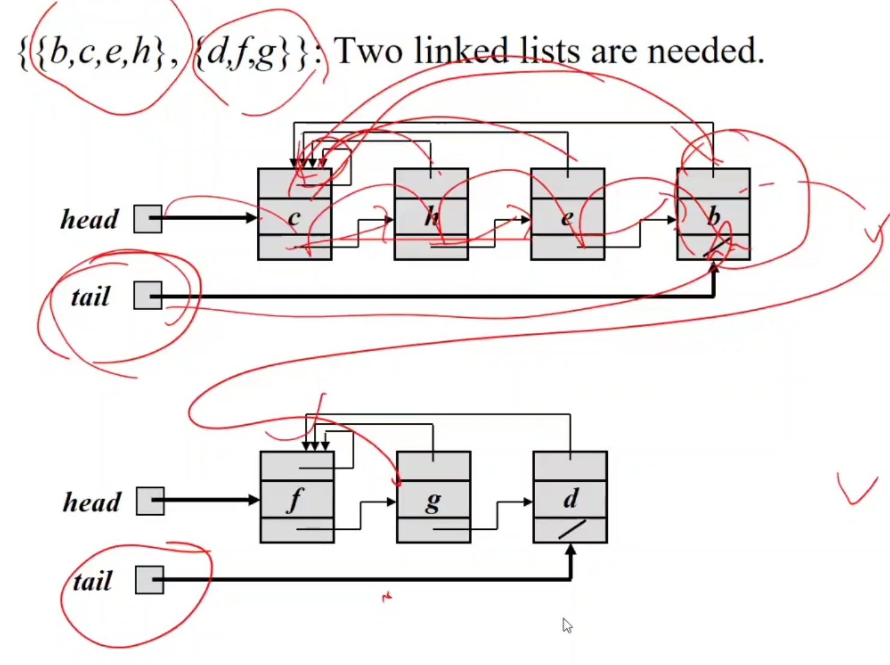
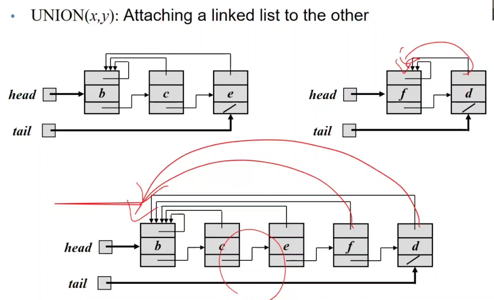
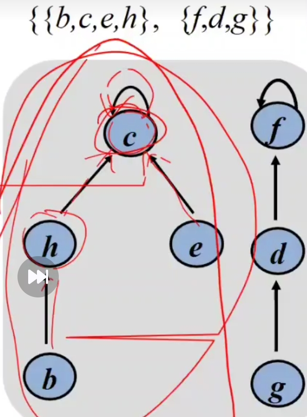
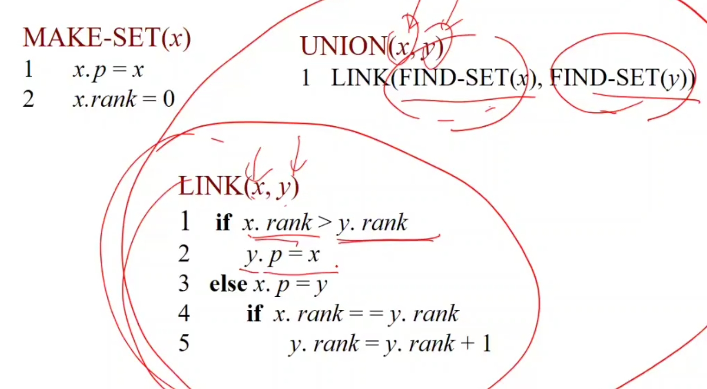

# Disjoint Sets

## 개념과 정의
- 서로소 집합(disjoint sets): 어떤 두 집합도 공통 원소를 가지지 않음
  - 예: A = {1, 2}, B = {3, 4}
- 서로소 집합의 컬렉션: 여러 개의 서로소 집합들의 모음
  - 예: {{1,2,3}, {4,8}, {5,7}}
- 지원 연산
  - MAKE-SET(x): 원소 x만을 포함하는 새로운 집합 생성
  - UNION(x, y): x와 y가 속한 집합을 합침
    - 예시: {{1,2,3}, {4,8}, {5,7}}에서 1과 4를 합치면 {{1,2,3,4,8}, {5,7}}이 됨
  - FIND-SET(x): x가 속한 집합의 대표 원소(루트)를 반환
    - 예시: FIND-SET(5): 7

## 효과적인 사용 분야
### Connected Components 계산
정적인 그래프에서는 DFS로 가능하지만, 동적인 그래프에서는 Disjoint Set이 효율적임.

### 코드
```C#
CONNECTED_COMPONENTS(G):
1. foreach vertex v ∈ G.V:
2.     MAKE-SET(v) // 초기화
3. foreach edge (u, v) ∈ G.E:
4.     if FIND-SET(u) ≠ FIND-SET(v):
5.         UNION(u, v) // 같이 안있을 경우 합침
// 같이 합친다는 것 같은 connected components로 묶인다는 것
```

## 구현 방식 및 성능
### Linked List 방식
- 각 집합은 연결 리스트로 표현
- 대표 원소는 리스트의 첫 번째 원소
- 시간복잡도
  - MAKE-SET: O(1)
  - FIND-SET: O(1)
  - UNION: Θ(n²)
- 예시
  - 
  - 

### Forest 방식
- 각 원소는 트리 노드, 부모 포인터를 가짐
- 루트가 대표 원소
- 
- FIND-SET: 부모를 계속 찾아감
- UNION: 2개의 트리를 합치는데 하나의 root를 다른 트리의 root로 연결(어떤걸 child로 연결할지는 find-set이 짧은게 유리)
  - 개선기법
    - Union by rank: 낮은 랭크(높이)의 트리를 높은 쪽에 붙임(rank는 root에 보관하며 height의 upper bound이다)
    - Path Compression: FIND-SET 호출 시 경로상의 노드들의 부모를 루트로 직접 연결(linked list 주소간에 연결 시 각각 부모로 연결할 경우 FIND-SET 호출 시 O(n) 걸림, root에 연결 시 O(1), 그래서 upper bound)
- 