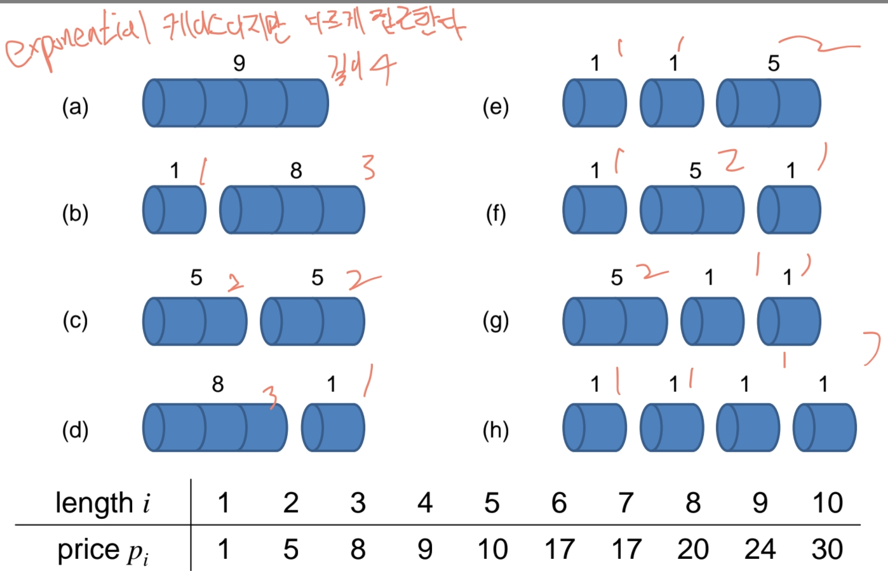

# Dynamic Programming
메모리를 사용해서 계산을 줄이는 방법

## Assembly-Line Scheduling (조립 라인 스케줄링)
- 문제 설명: 두 개의 조립 라인과 n개의 작업 스테이션이 있을 때, 자동차가 조립 라인을 따라 가장 빠르게 완성되도록 경로를 결정하는 문제.

- 접근 방식:
  - t1,j와 t2,j를 각 라인에서 j번째 작업까지 걸리는 최소 시간으로 정의.
  - 각 작업 지점에서 어떤 라인을 선택할지를 l1[j], l2[j] 배열에 저장해 추적.

- 복잡도:
  - 시간: Θ(n)
  - 공간: Θ(n) (단순 결과만 원하면 Θ(1)까지 줄일 수 있음)

- 예시1
  - 
- 예시2
  - 
  - 위는 무차별 대입법(Brute-force)으로 2^n개라 너무 많다.
- 그래서 빠른 시간에 도달하는 것을 찾아야한다.(이전 값과 경로 값을 비교)
- dynamic programming 적용해서 복잡도 줄임 2^n -> O(n), 지수시간에서 선형시간으로 성능이 좋아짐
  - 
  - 어느경로로 왔는지 메모리 공간에 보관
  - 공간은 2n(빅오n)이 필요한데 복원의 필요성이 없고 얼마나 빠르게 가능하냐가 문제이면 사실상 4개로(빅오1) 줄일 수가 있음(이전 것과 현재 것만 보관)
- 슈도코드
  - 

## Rod Cutting (막대 자르기)    
- 문제 설명: 길이 n인 막대를 여러 개의 조각으로 자르고, 각 길이에 해당하는 가격표에 따라 총 수익을 최대화.
- 접근 방식:
  - 점화식: r[n] = max(p[i] + r[n-i]) (1 ≤ i ≤ n)
  - 동적 테이블 r[], 선택한 길이를 추적하기 위한 s[] 사용.
- 복잡도:
  - 시간: Θ(n²)
  - 공간: Θ(n)
- 길이별 가격표 예시
  - 
- 최대의 이익을 찾아가는 과정
  - 
- 복원이 필요할 경우 
  - 
- 슈도코드
  - 
- 공간복잡도를 Assembly-Line처럼 줄일 수 없음. 나눴을때 이전 값들이 필요함

## Longest Common Subsequence (최장 공통 부분 수열)
- 문제 설명: 두 문자열 X, Y에 대해 공통된 부분 수열 중 가장 긴 것을 찾기.
- 용어 정의
  - Substring: CBD는 AB**CBD**AB의 substring이다.
  - Subsequence: BCDB는 A**BC**B**D**A**B**의 subsequence이다.
  - Common subsequence: BCA는 X=A**BC**BD**A**B, Y=**B**D**CA**BA의 common subsequence이다.
  - Longest common subsequence: BCBA는 X=A**BCB**D**A**B, Y=**B**D**C**A**BA** 이다.(여러개 가능함)
- 접근 방식:
  - **c[i][j]**: X의 i번째까지, Y의 j번째까지를 고려했을 때 LCS 길이
  - **b[i][j]**: 방향 정보를 저장 (↖, ↑, ←)
- 복잡도
  - 시간: Θ(mn), 길이 같으면(n²)
  - 공간: Θ(mn) → LCS 길이만 필요하면 Θ(min(m,n))으로 축소 가능, 길이 같으면(n²)
- 일반적인 정의
  - 
  - 
- 슈도코드
  - 
  - 

## Matrix-Chain Multiplication (행렬 곱셈 최적 순서)
- 문제 설명: 여러 개의 행렬 곱셈 순서를 바꿔서 계산 횟수를 최소화.(결과는 순서에 상관없이 같지만 연산량이 다름)
- 접근 방식:
  - **m[i][j]**: i번째부터 j번째 행렬까지 곱하는 데 필요한 최소 연산 수
  - **s[i][j]**: 최소 연산이 되는 분할 지점 k 저장
- 복잡도:
  - 시간: Θ(n³)
  - 공간: Θ(n²)
- 연산량 차이 예시
  - 