# Elementary Graph Algorithms

## Graph Basics
- 정의: 그래프 G는 정점 집합 V와 간선 집합 E로 구성됨 (G = (V, E))
- 방향 그래프와 무방향 그래프 구분
  - 방향 그래프: 간선이 방향성을 가짐 (ex. 2 → 4)
  - 무방향 그래프: 간선은 방향이 없음
- 정점 간 인접(adjacency) 및 차수(degree)
  - 무방향 그래프에서 정점 u와 v가 인접하면 u↔v
  - 방향 그래프에서는 u→v 일 때 u가 v에 인접함(v가 u에 인접한건 아님)
  - degree = in-degree(들어오는 간선) + out-degree(나가는 간선), self degree는 out과 in 모두 포함
- Simple Path
  - 경로 상의 모든 정점이 서로 다를 때 해당 경로를 simple path라고 합니다.(중복 정점이 없다)
  - 예시
    - <1, 2, 4, 5> 는 simple path
    - <1, 2, 4, 1, 2> 는 simple path가 아님 (정점 1과 2가 반복됨)
- Simple Cycle
  - 사이클 <v₀, v₁, ..., vₖ>에서 v₀ = vₖ이고, 중간 정점 v₁ ~ vₖ이 모두 다를 경우, simple cycle이라고 합니다.(사이클의 시작과 끝은 같아야 함)
  - 예시
    - <1, 2, 4, 1> 은 simple cycle
    - <1, 2, 4, 1, 2> 는 simple cycle이 아님 (정점 1과 2가 반복됨)
- Connected Graph  
  - **무방향 그래프**에서 모든 정점 쌍 간에 경로가 존재하면 connected graph라고 함.
  - 연결 요소가 하나뿐
- Connected Components
  - 무방향 그래프에서 서로 도달 가능한 정점들로 구성된 최대 부분 그래프(subset은 포함 X)
- Strongly Connected Graph
  - **방향 그래프**에서 모든 정점 쌍 간에 경로가 존재하면 strongly connected graph라고 함.
  - 연결 요소가 하나뿐
  - 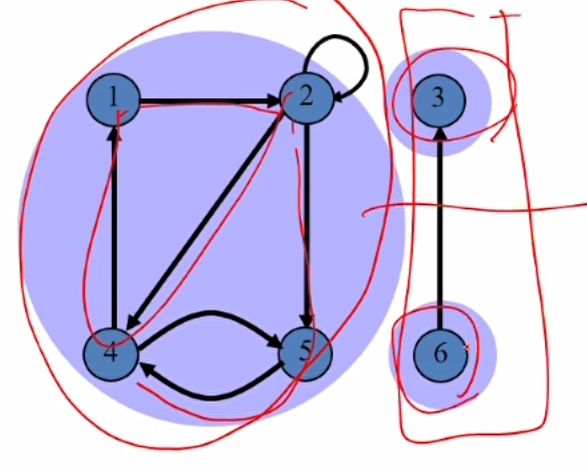
  - 위 예시는 component가 3개로 나뉘어져 있음
- complete graph
  - 모든 노드가 연결되어 있는 그래프
- bipartite graph
  - 무방향 그래프에서 두개로 나누어진 노드의 집합 V1, V2가 있을 때 집합 간에는 모든 엣지가 존재, 같은 집합 안에서는 엣지가 없음
  - 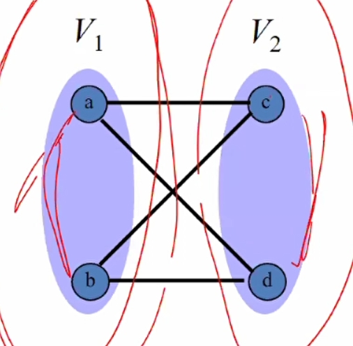
- Forest
  - 사이클이 없고, 무방향 그래프
  - 여러 개의 트리로 구성된 그래프
- Tree
  - 사이클이 없고, 연결된 무방향 그래프, unique simple path
  - 어떤 엣지를 끊어도 그래프는 끊어진다.
  - 어떤 엣지를 더해도 사이클이 생긴다.
- Dag(Directed Acyclic Graph)
  - 사이클이 없는 방향 그래프

## Graph Representation
- 인접 리스트(Adjacency List)
  - 각 정점에 대해 인접한 정점들의 리스트를 저장하는 방법
  - 공간 복잡도: O(V + E)
  - Sparse graph 적합(vertex 수에 비해 edge 수가 적은 경우)
  - directed graph 예시
    - 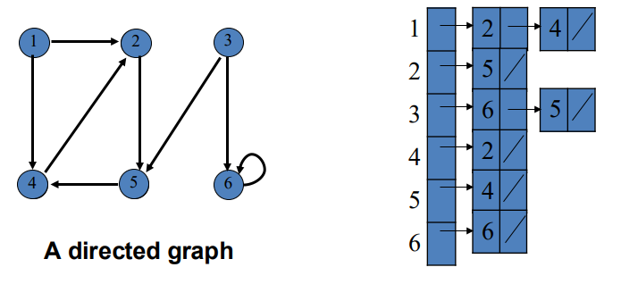
  - undirected graph 예시
    - 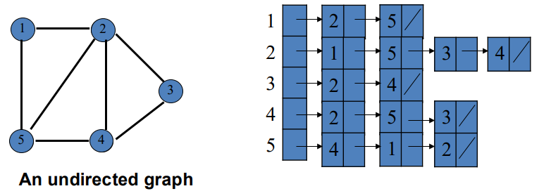
- 인접 행렬(Adjacency Matrix)
  - 정점 간 연결 여부로 행렬로 표현
  - 공간 복잡도: 정점 수가 n일 때 O(n²)의 
  - dense graph에 적합
  - 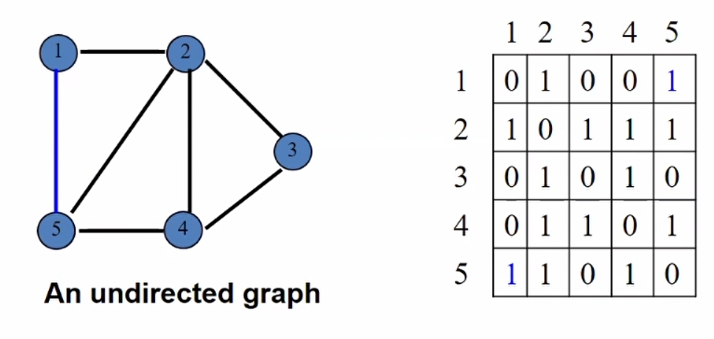
  - undirected 그래프인 경우 대칭형태라서 절반만 필요함 
- Weighted graph
  - edge에 가중치가 있는 그래프
  - adjacency list 예시
    - 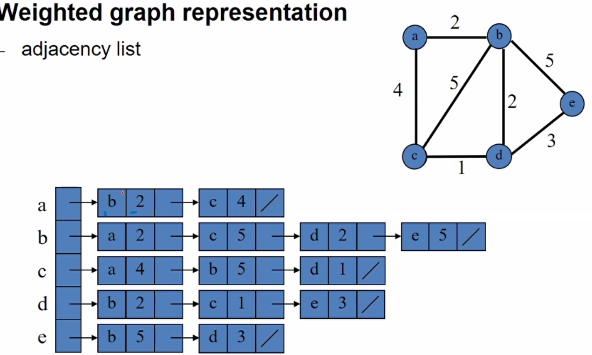
  - adjacency matrix 예시
    - 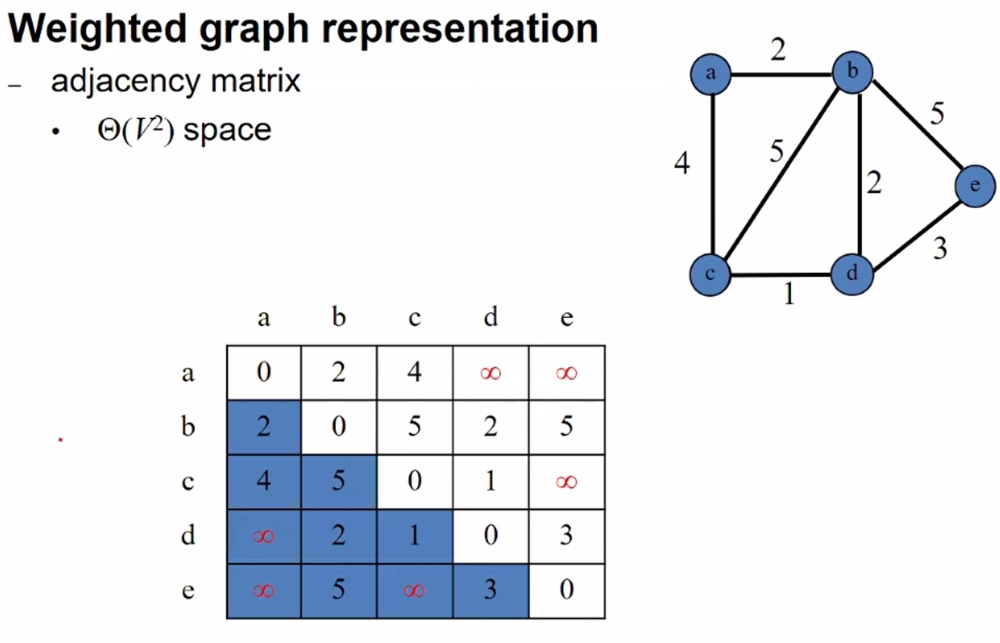

## Graph Search
실용적으로 메모리 때문에 DFS를 많이 씀.(경로만 가지고 있음, 선형적임) 반면 bfs는 기하급수적이다.

### BFS(Breadth-First Search)
- 작동 원리: 시작 정점으로부터 거리 순으로 정점들을 방문
- 큐(Q) 사용
- 각 정점에 대한 거리 및 부모 정점 기록
- 시간복잡도: Θ(V + E)
- 활용 예:
  - 최단 경로 계산 (단위 가중치)
  - 이분 그래프 판별
  - 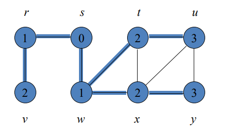
  - 위 예시는 s 기준으로 각 노드까지 거리
- 슈도코드
  - 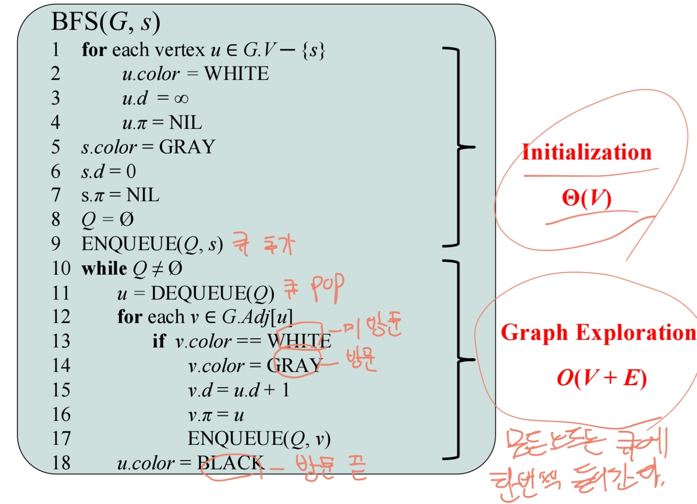

### DFS(Depth-First Search)
- 작동 원리: 가능한 깊이까지 탐색 후 백트래킹
- 각 vertex v에 대한 발견 시간(v.d) 및 종료 시간(v.f) 기록
- 시간복잡도: Θ(V + E)
- 간선 분류:
  - 트리 간선, 뒤로 가는 간선(back edge), 순방향 간선(forward edge), 교차 간선(cross edge)
  - 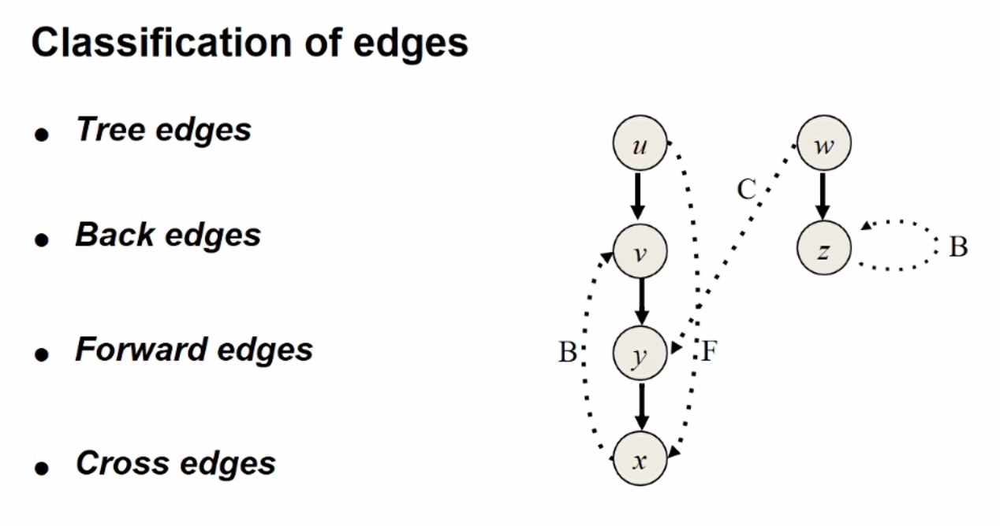
- 예시
  - 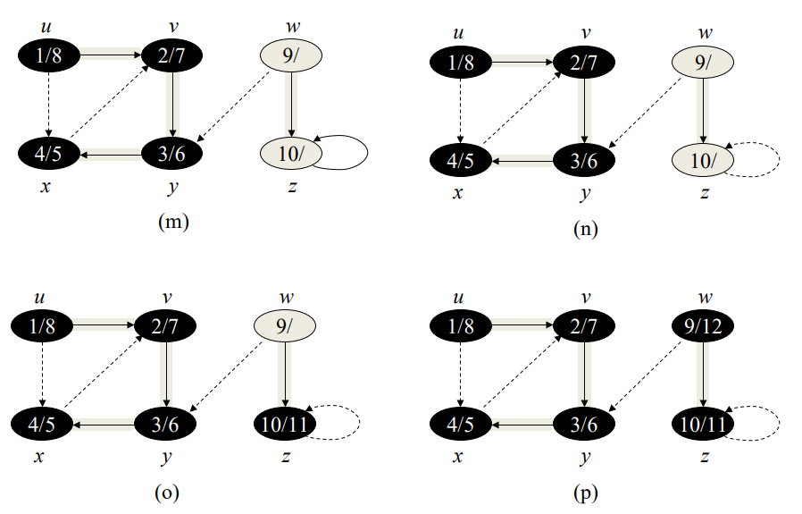
- 슈도코드
  - 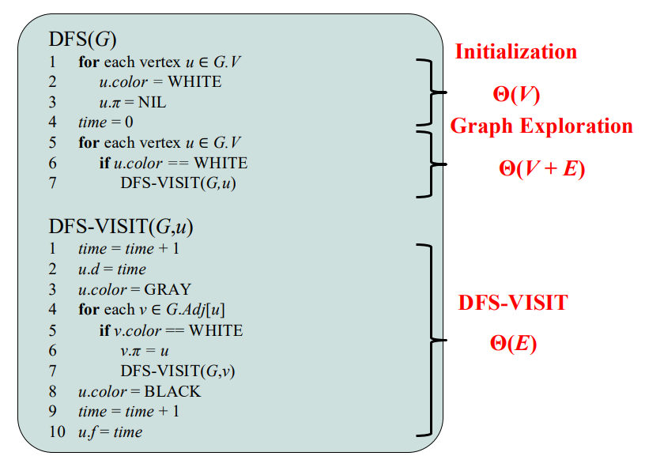

### Topological Sort(위치관계에 맞게 정렬해라)
DAG에서만 정의되는 정렬 방법으로, 모든 간선 (u → v)에 대해 정점 u가 v보다 먼저 나오는 선형 순서
- 예시
  - 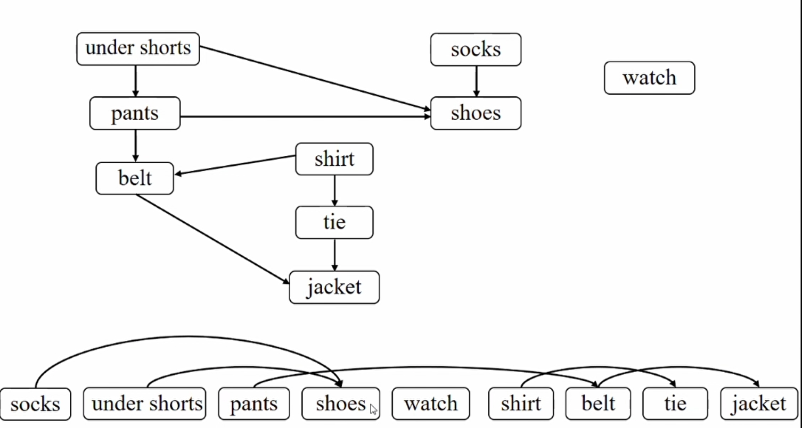
  - 밑에 정렬 순서는 degree 오름차순
  - 같은 degree면 어떤 것을 먼저해도 상관은 없다.
  - stack을 이용할 경우
    - 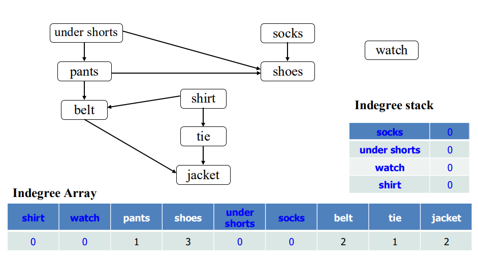
    - socks는 날리고 차수로 가지고 있는 shoes의 degree를 줄여준다.
    - under shorts를 날리고 pants의 degree를 줄여준다.
    - 그리고 pants의 degree가 0이 되었으니 stack에 넣는다.
    - under shorts를 날렸으므로 shoes의 degree를 줄여준다.
    - 쭉 반복....
    - 결론은 아래와 같아 진다.
    - 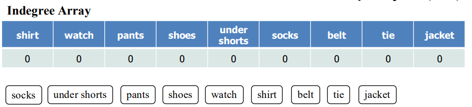
  - dfs 기반인 경우 finish time을 이용하여 역순으로 정렬
    - 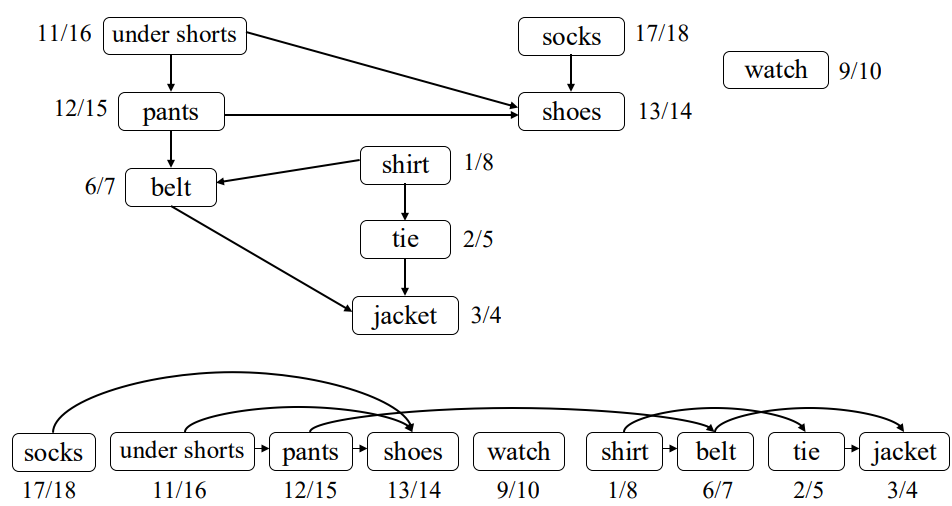