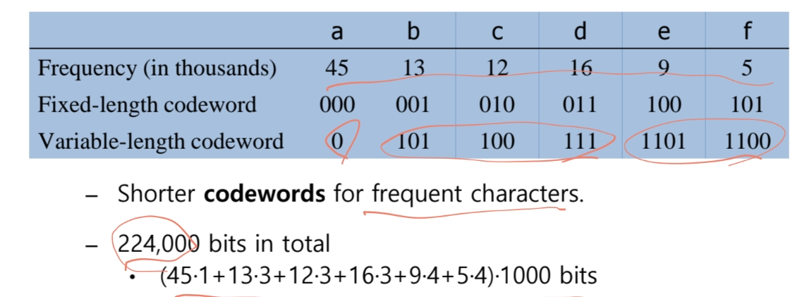
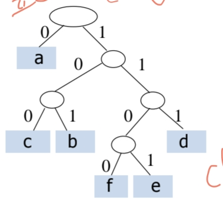

# Greedy Algorithm
- 탐욕 알고리즘(Greedy Algorithm)은 현재 상황에서 가장 좋아 보이는(=locally optimal) 선택을 반복적으로 수행하여 전역적으로 최적의 해(global optimum)를 찾고자 하는 전략
- 중요한 특징은 아직 해결되지 않은 부분 문제들을 고려하지 않고, 바로 결정을 내린다는 점입니다
  - 이는 동적 계획법(Dynamic Programming)과의 큰 차이점입니다.
    - 동적 계획법은 하위 문제들을 모두 해결한 뒤, 그 결과를 바탕으로 결정을 내림
    - 반면 탐욕 알고리즘은 결정을 먼저 내리고, 이후 남은 문제를 해결합니다
  - 동적 계획법, 탐욕 알고리즘이 잘 작동하는 예시와 그렇지 않은 예시
    - Fractional Knapsack(부분 배낭 문제) 
      - 탐욕 알고리즘 사용 가능, 항상 최적해 보장
      - 각 물건은 쪼갤 수 있으며, 단위 무게당 가치가 높은 순으로 물건 넣음
    - 0/1 Knapsack(0/1 배낭 문제)
      - 동적 계획법 사용, 탐욕 알고리즘 사용 불가, 최적해 보장 안됨
      - 각 물건은 쪼갤 수 없으며, 전부 넣거나 안넣어야함.
    - 

## 활동 선택 문제(Activity Selection Problem)
- 하나의 자원(예: 강의실)을 사용하려는 여러 활동들이 있을 때, 서로 겹치지 않는 활동들을 선택하여 최대한 많은 활동을 선택하는 것이 목표입니다.
- 알고리즘
  - 활동의 집합 S = {a1, a2, ... , an}이 주어질 때, 각 활동 ai는 시작 시간 si와 종료 시간 fi를 가지며 종료시간으로 오름차순 정렬
  - 가장 먼저 끝나는 활동부터 선택하고, 겹치지 않는 활동 중 다음으로 끝나는 활동을 반복 선택
  - 
    - 빨강: 상호호환활동, 최대 set 아님
    - 파랑, 초록: 상호호환활동, 최대 set
    - 시작시간과 종료시간을 표로 구성해서 정렬, 선택
      - 

## Huffman Coding(탐욕 알고리즘의 대표 응용)
- 문자 압축 알고리즘 중 하나로, 자주 등장하는 문자에는 짧은 코드를 할당하는 방식
  - 
- 핵심 아이디어: 가장 빈도수가 낮은 두 문자를 결합 → 트리 형성 → 반복
- 탐욕적 선택 기준: 매번 가장 빈도 낮은 두 노드를 선택
- 중복문제의 경우 특정 codeword의 prefix가 다른 codeword가 되지 않도록 unique한 특성을 가지게 설계함
  - 예를 들어 a:0, b:01, c: 1일 경우 001을 decoding할 경우 aac or ab가 되므로 unique하지 않다.
  - 이진트리로 codeword를 형성해가는게 있는데 각 codeword가 leaf node일 경우 unique하는 것이 보장된다.
    - 
    - 여기서 tree 형태를 full binary tree 형태로 갈 경우 optimal 조건이 만족하고 위가 그런 형태이다.
    - full binary tree는 각 노드가 leaf node이거나 두개의 child node를 가지는 트리이다.
    - 또한 C개의 알파벳이 있으면 C개의 leaves와 C-1개의 internal nodes를 가지게 된다.
    - 
  - tree를 만드는 방법은 아래와 같다.(작은 빈도 수끼리 묶어서 bottom-up 으로 올림, 빈도 적은게 코드 길게)
    - 
  - tree를 구성하기 위해서 빈도수가 가장 작은 두 노드를 빠르게 찾아야 하는데, min-heap을 사용할 경우 O(nlogn)의 시간복잡도로 가능하다.
    - heap의 루트가 항상 최소값이기 때문에 가장 작은 노드를 즉시 찾을 수 있음.
    - build heap의 경우 아래와 같음, O(n)
      - 
    - delete와 insert, min heapify를 반복하여 구성, O(logn)
      - 
    - n-1번, O(nlogn)