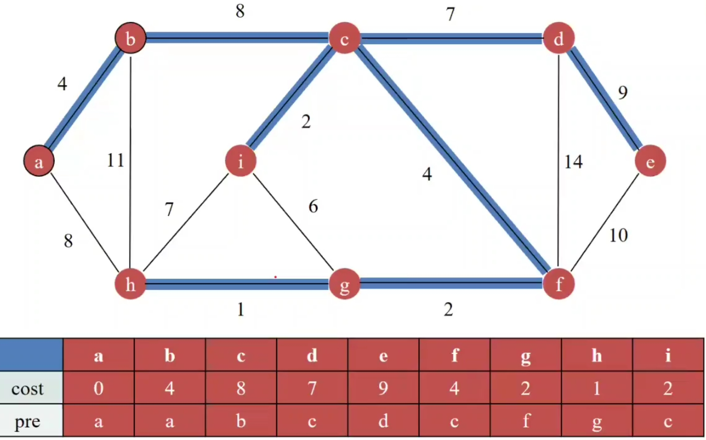
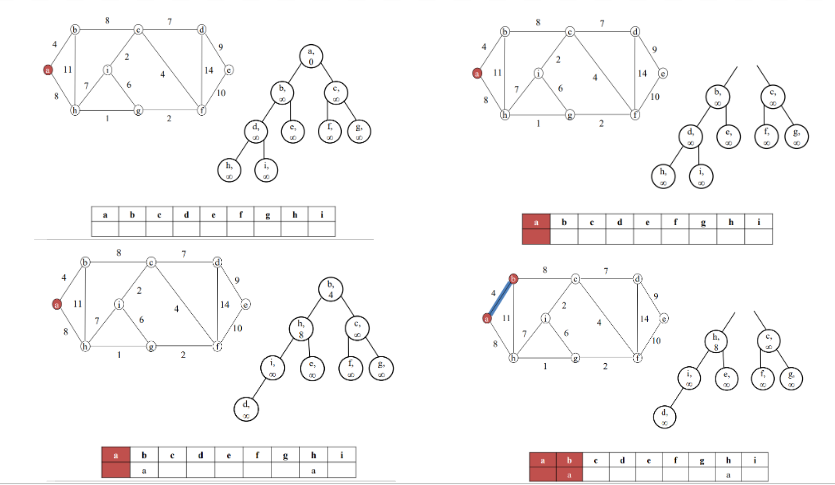
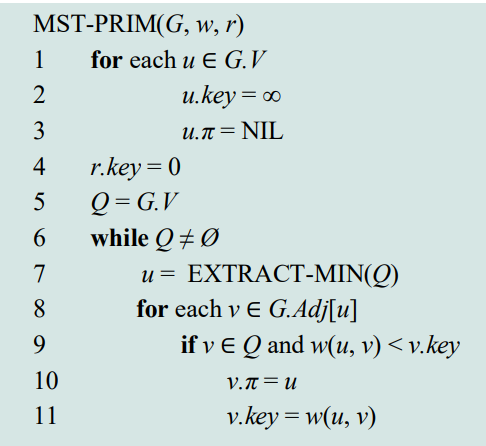
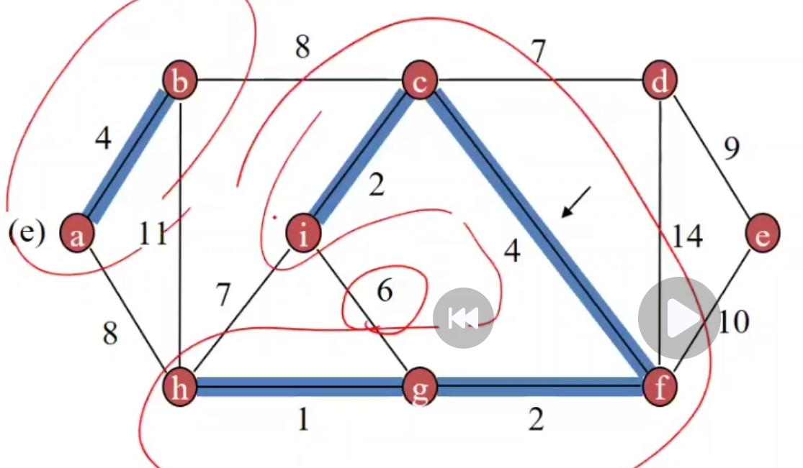
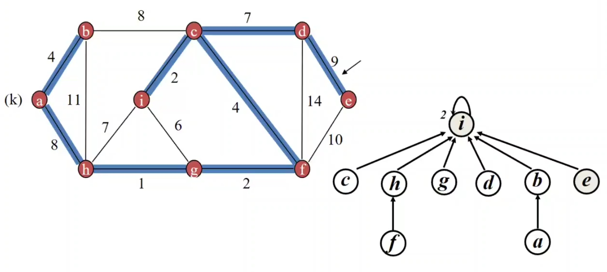
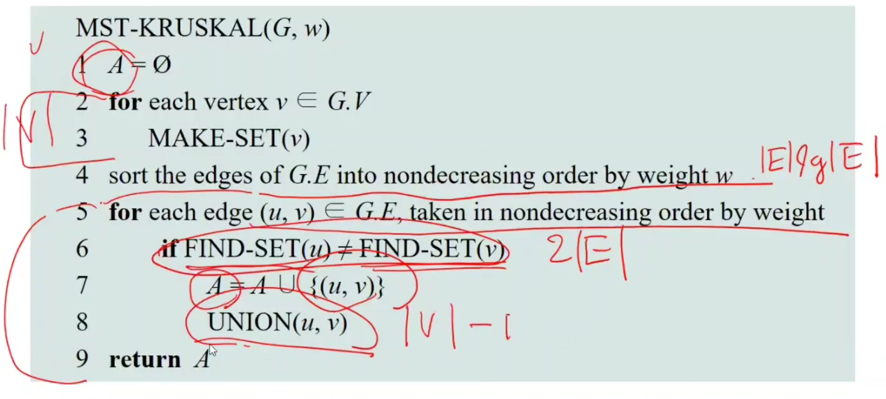

# Minimum Spanning Tree
- 신장 트리(Spanning Tree): 연결 그래프 G=(V,E)에서 모든 정점을 포함하고 사이클이 없는 부분 그래프.
- 최소 신장 트리(MST): 가중치가 있는 연결 그래프에서 신장 트리 중 간선 가중치의 합이 최소인 트리.

- 핵심 속성
  - Cut Property
    - 컷(cut): 정점 집합 V를 두 개의 분리된 부분 집합으로 나눈 것.
    - 어떤 컷에 대해 그 컷을 가로지르는 최소 가중치의 간선은 반드시 MST에 포함된다.
  - Cycle Property
    - 사이클 내에서 가장 큰 가중치를 가진 간선은 MST에 포함되지 않는다.

## Prim's Algorithm
한 정점에서 시작해서 가장 가까운 정점을 하나씩 확장해가며 MST 구성.
- 프로세스
  1. 아무 정점에서 시작
  2. 인접한 간선 중 가장 작은 가중치를 가진 간선 선택
  3. 선택된 간선을 통해 새로운 정점을 트리에 포함
  4. 모든 정점이 포함될 때까지 반복
- 프로세스 예시
  - 
  - min heap을 사용할 경우 아래와 같다.
    - 
- 시간 복잡도
  - 노드보다 엣지 크기가 더 크다(connected graph)
  - Binary heap 사용 시 O(E log V)
  - Fibonacci heap 사용 시 O(E + V log V)
- 슈도 코드
  - 

## Kruskal's Algorithm
- 작은 간선부터 하나씩 추가하면서 MST를 구성.
- 사이클을 만들지 않도록 Disjoint Set을 사용.
  - 

- 프로세스
  1. 간선을 가중치 기준으로 오름차순 정렬
  2. 하나씩 간선을 선택 -> 사이클이 발생하지 않으면 MST 추가
  3. 간선 수가 V-1개가 되면 종료
- 프로세스 예시
  - 
- 시간 복잡도
  - O(E log E): 정렬
  - Union-Find 최적화 사용 시 거의 선형 시간
- 슈도 코드
  - 