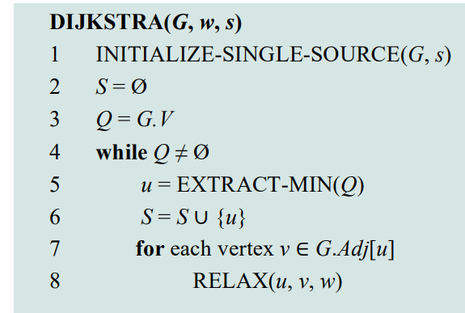

# Single Source Shortest Paths
- Shortest Path (최단 경로): 시작 정점 u에서 도착 정점 v까지 경로 중 가중치 합이 가장 작은 경로
- Shortest-path weight δ(u,v): u에서 v까지의 최단 경로의 총 가중치.
- 주요 문제 유형
  - Single-source & single-destination
  - Single-source to all destinations
  - Single-destination from all sources
  - All pairs shortest paths

## 음수 가중치 엣지(Negative-weight edges)
- 모든 음수 간선이 문제를 일으키진 않음.
- 음수 가중치 순환(Negative-weight cycle)이 존재하고 시작점으로부터 도달 가능하면 최단 경로 정의 불가.
- 따라서 음수 순환이 없을 경우에만 single-source shortest path 정의가 가능함

## Relaxation (완화)
- 기존에 u, v까지 가는데 거리가 각각 5, 9인데 u에서 v로 가는 엣지의 가중치가 2일 경우, u에서 v까지의 거리는 5 + 2 = 7이 됨. 그리고 v는 7이 됨. 
- 

## Dijkstra’s Algorithm
- 제약: 모든 간선의 가중치가 0 이상 (비음수)이어야 함.
- 동작
  - d[s] = 0, 나머지 정점의 d[v] = ∞
  - 미방문 정점 중 d[v]가 가장 작은 정점을 선택 (최소 힙 활용)
  - 해당 정점에서 이웃 정점에 대해 Relaxation 수행3
- 시간 복잡도:
  - 배열 사용 시: O(V²)
  - 최소 힙 사용 시: O((V+E) log V)
- 슈도코드
  - 
- 예시
  - 
  - 

## Bellman-Ford Algorithm
- 특징: 음수 가중치 허용, 음수 순환 감지 가능
- 동작:
  1. 모든 간선을 V−1번 반복하여 Relaxation
  2. 추가로 한 번 더 반복하여 음수 순환 여부 확인
  3. 음수 순환이 있으면 FALSE 반환
- 시간 복잡도: O(VE)
- 슈도코드
  - 

## DAG에서의 최단 경로
- DAG (Directed Acyclic Graph)에서는 위상 정렬 후 Relaxation 수행으로 효율적 계산 가능
- 시간 복잡도: O(V + E)
- 슈도코드
  - 